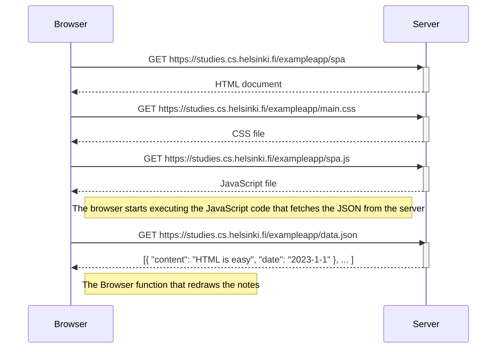

# SPA page load diagram

A diagram depicting the situation where the user first visits the page https://studies.cs.helsinki.fi/exampleapp/spa.

```mermaid
  sequenceDiagram
    participant Browser
    participant Server

    Browser->>+Server: GET https://studies.cs.helsinki.fi/exampleapp/spa

    Server-->>-Browser: HTML document

    Browser->>+Server: GET https://studies.cs.helsinki.fi/exampleapp/main.css

    Server-->>-Browser: CSS file

    Browser->>+Server: GET https://studies.cs.helsinki.fi/exampleapp/spa.js

    Server-->>-Browser: JavaScript file

    Note right of Browser: The browser starts executing the JavaScript code that fetches the JSON from the server

    Browser->>Server: GET https://studies.cs.helsinki.fi/exampleapp/data.json
    activate Server
    Server-->>Browser: [{ "content": "HTML is easy", "date": "2023-1-1" }, ... ]
    deactivate Server

    Note right of Browser: The Browser function that redraws the notes

```
