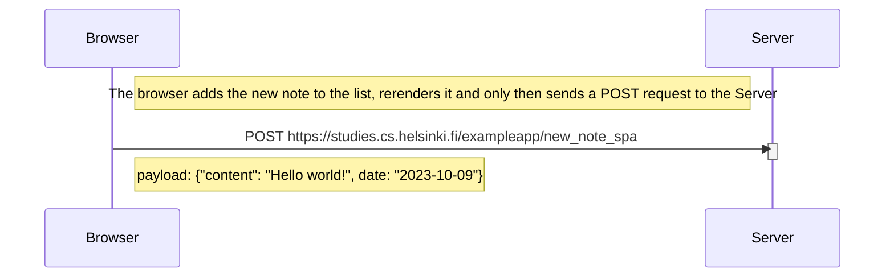

# New note diagram in single page application

A diagram depicting the situation where the user creates a new note on the page https://studies.cs.helsinki.fi/exampleapp/notes by writing something into the text field and clicking the Save button.

As an example, we try to add a note saying "Hello world!"

